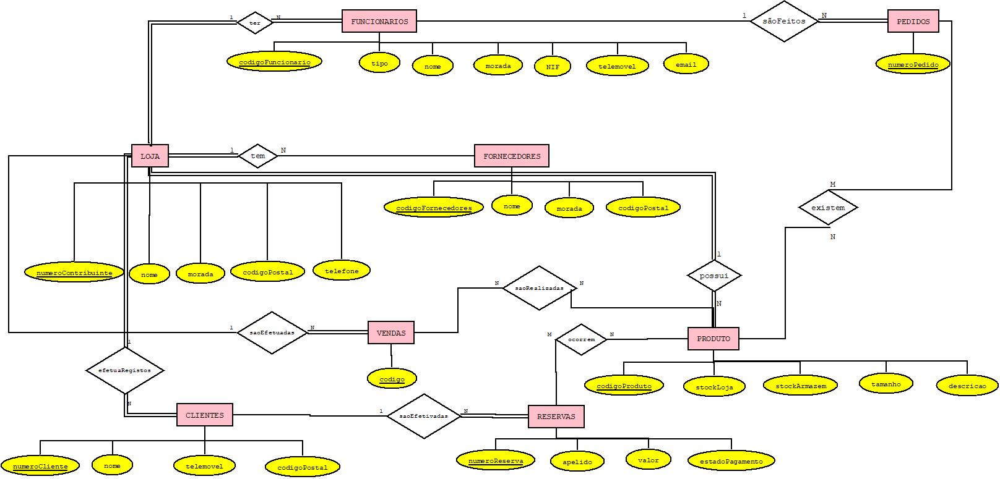

# C2 : Esquema conceptual

## Modelo E/A
#### As entidades tipo definidas são:

LOJA ( _ numeroContribuinte _ , nome , morada , codigoPostal , telefone )

VENDAS ( _ codigo _ )

CLIENTES ( _ numeroCliente _ , nome , telemovel , codigoPostal )

PRODUTO ( _ codigoProduto _ , stockLoja , stockArmazem , tamanho , preco , descricao )

RESERVAS ( _ numeroReserva _ , apelido , valor , estadoPagamento )

PEDIDOS ( _ numeroPedido _ )

FORNECEDORES ( _ codigoFornecedores _ , nome, morada , codigoPostal )

FUNCIONARIOS ( _ codigoFuncionario _ , tipo , nome , morada , NIF , telemovel , email )

#### As associações definidas são:

saoEfetuadas ( LOJA , VENDAS ) , 1:N , P/T

tem ( LOJA , FORNECEDORES ) , 1:N , T/P

efetuaRegistos ( LOJA , CLIENTES ) , 1:N , T/T

possui ( LOJA , PRODUTO ) , 1:N , T/T

saoEfetivadas ( CLIENTES , RESERVAS ) , 1:N , P/T

saoFeitos ( FUNCIONARIOS , PEDIDOS ) , 1:N , P/T

trabalhaEm ( LOJA , FUNCIONARIOS ) , 1:N , T/T

saoRealizadas ( VENDAS , PRODUTO ) , N:N , T/P

ocorrem ( RESERVAS , PRODUTO ) , M:N , T/P

existem ( PEDIDOS , PRODUTO ) , M:N , T/P

  

## Regras de negócio adicionais (Restrições)

As regras de negócio adicionais são:

- Apenas é possível fazer pedidos a fornecedores se o funcionário autenticado for o gerente;

- Para ser efetuada uma venda, o stock do produto em loja e/ou armazém tem que ser superior a 0;

---
[< Previous](rebd01.md) | [^ Main](https://github.com/leonorVicente/tcm21-sibd-g10/) | [Next >](rebd03.md)
:--- | :---: | ---: 
